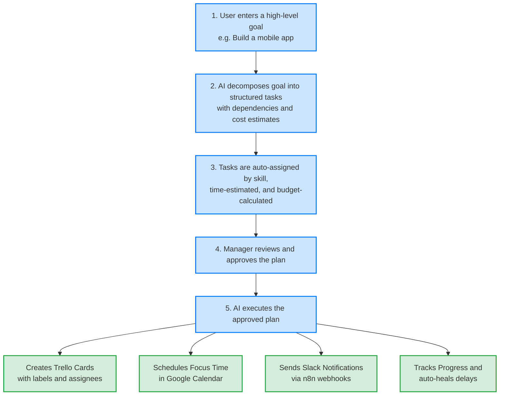
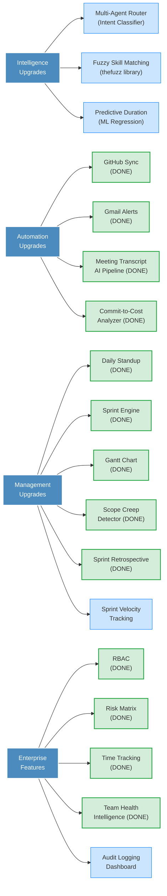

<p align="center">
  
  
  
  
  
  
  
</p>

<h1 align="center">🤖 Autonomous AI Project Manager</h1>

<p align="center">
  <strong>An intelligent, tool-driven AI agent that autonomously reasons, plans, and executes project management workflows — powered by Groq LLMs (Llama 3.1 / 3.3), Gemini Embeddings, and Pinecone Vector Memory.</strong>
</p>

<p align="center">
  <a href="#-overview">Overview</a> •
  <a href="#-how-it-works">How It Works</a> •
  <a href="#-user-flow--available-tasks">User Flow</a> •
  <a href="#-technology-stack">Tech Stack</a> •
  <a href="#-system-architecture">Architecture</a> •
  <a href="#-key-features">Features</a> •
  <a href="#-project-structure">Structure</a> •
  <a href="#-getting-started">Getting Started</a> •
  <a href="#-api-reference">API</a> •
  <a href="#-deployment">Deployment</a> •
  <a href="#-roadmap">Roadmap</a>
</p>

---

## 📌 Overview

Traditional project management suffers from fragmented tooling, manual coordination, poor skill-based task allocation, budget overruns, and no proactive risk detection. Managers constantly track dependencies, deadlines, and costs manually — leading to persistent inefficiencies.

**This project solves that** by introducing an **Autonomous AI Project Management Agent** that converts high-level goals into structured execution plans, monitors progress in real time, and self-heals when things go off track — all while keeping humans in control of critical decisions.

### Why This Project Stands Out

| | |
| :---: | :--- |
| 🧠 | **Autonomous AI Agent Architecture** — LangChain tool-binding with 16 specialized tools for end-to-end project orchestration, sprint planning, risk prediction, retrospectives, team health, and commit analysis |
| 🏃 | **Full Agile Engine** — Epic → Story → Task hierarchy, sprint planning with burndown charts, scope creep detection, and time tracking |
| 📊 | **Visual Timeline** — Canvas-rendered Gantt chart with dependency arrows, critical path highlighting, zoom controls, and epic filtering |
| 🔗 | **Real-World Integrations** — Trello, Slack, Google Calendar, Gmail, and GitHub, all wired through n8n middleware (8 active workflows) |
| 🔁 | **Self-Healing Scheduling** — Automatically detects overdue tasks, reschedules them to the next business day, and cascades date changes to dependent tasks |
| ⚠️ | **AI Risk Intelligence** — Pre-mortem risk prediction with 5×5 probability × impact matrix and AI-generated mitigation strategies |
| 💰 | **Cost-Aware Planning** — Budget estimation using employee hourly rates, tool costs, and real-time burn rate analysis with actual vs estimated reconciliation |
| 🔐 | **Production-Ready** — JWT auth with RBAC (Admin/PM/Developer), 14 protected endpoints, session-based chat memory, CORS-hardened FastAPI backend, and Angular 20 SSR frontend |
| 🧠 | **Team Intelligence** — Mood-velocity correlation engine, sprint retrospective auto-generation, and commit-to-cost developer productivity analysis |

---

## 🧠 How It Works



---

## 🗺 User Flow & Available Tasks

The diagram below maps every action a user or manager can take, and how the AI backend transitions from intent to physical execution across external tools.

```mermaid
graph TD
    classDef userAction fill:#d4edda,stroke:#28a745,stroke-width:2px,color:#333;
    classDef aiSystem fill:#cce5ff,stroke:#007bff,stroke-width:2px,color:#333;
    classDef external fill:#fff3cd,stroke:#ffc107,stroke-width:2px,color:#333;

    User(["User / Project Manager"])

    subgraph User_Capabilities ["User Capabilities"]
        A["Enter High-Level Goal in Chat"]:::userAction
        B["Upload Project Documents"]:::userAction
        C["Ask Questions About Project Context"]:::userAction
        D["Review and Approve / Reject Plan"]:::userAction
        E["View Dashboard and Burn Analysis"]:::userAction
        F["Trigger Risk Evaluation"]:::userAction
        G["Manage Team / Employees"]:::userAction
        H["Schedule Meetings"]:::userAction
        I["Send Slack Announcements"]:::userAction
        J["Submit Mood Score"]:::userAction
        K["View Sprint Retrospective"]:::userAction
        Z["Login / Register / Update Profile"]:::userAction
    end

    User --> A
    User --> B
    User --> C
    User --> D
    User --> E
    User --> F
    User --> G
    User --> H
    User --> I
    User --> J
    User --> K
    User --> Z

    subgraph AI_Processing ["AI Processing and RAG Memory"]
        API["FastAPI Backend\n(server.py — 3700+ lines)"]:::aiSystem
        Agent["Groq LLM + LangChain\n16 Bound Tools"]:::aiSystem
        Standup["Daily Standup Report\nvia n8n Cron"]:::aiSystem
        RAG["Pinecone Vector DB\nDocument Context"]:::aiSystem

        API <-->|"Intent Resolution\nand Tool Execution"| Agent
        Agent <-->|"Retrieve Document Context"| RAG
        B -->|"Autonomous Ingestion\nand Vectorization"| RAG
        A --> API
        C --> API
        H --> API
        I --> API
        J -->|"Mood Webhook"| API
        K -->|"Generate Report"| API
        E -->|"Fetch Trello Baselines\nand Cost Data"| API
        F -->|"Force Schedule Check"| API
    end

    subgraph Planning_Engine ["Planning Engine"]
        Plan["Task Breakdown with\nTopological Sorting"]:::aiSystem
        Timeline["Smart Timeline\nSkips Weekends and Holidays"]:::aiSystem
        Budget["Budget Estimation\nPersonnel + Tool Costs"]:::aiSystem
        Assign["Skill-Based Auto-Assignment\nfrom MongoDB Roster"]:::aiSystem
        Agent --> Plan
        Plan --> Timeline
        Timeline --> Budget
        Budget --> Assign
        Assign --> D
    end

    subgraph Intelligence_Engine ["Intelligence Engine"]
        Retro["Sprint Retrospective\nAI Report Generator"]:::aiSystem
        Mood["Team Health Analyzer\nMood × Velocity Correlation"]:::aiSystem
        Commit["Commit-to-Cost Analyzer\nDeveloper Productivity"]:::aiSystem
        Agent --> Retro
        Agent --> Mood
        Agent --> Commit
    end

    subgraph Execution_Phase ["Execution Phase"]
        Exec["Execute Approved Plan"]:::aiSystem
        D -->|"One-click Approve or Reject"| API
        API --> Exec
    end

    subgraph Integrations ["Integrations and Automations"]
        Trello["Trello\nCreate Cards, Labels, Assign Members"]:::external
        GCal["Google Calendar\nBook Meetings and Focus Time"]:::external
        n8n["n8n Middleware\n8 Active Workflows"]:::external
        Slack["Slack\nAnnouncements and Standup Reports"]:::external
        Gmail["Gmail\nUrgent Task Email Alerts"]:::external
        GitHub["GitHub\nPush + Commit Webhooks"]:::external

        Exec -->|"Create via n8n webhook"| Trello
        Exec -->|"Book Focus Time blocks"| GCal
        Exec -->|"Webhook Triggers"| n8n
        n8n --> Slack
        n8n --> Gmail

        API -->|"Self-healing Schedule\nDirect Trello API"| Trello
        API -->|"Check Availability and\nAuto-reschedule"| GCal
        GitHub -->|"Push events with\nStarted/Fixed #ID"| n8n
        GitHub -->|"Commit data webhook"| API
        n8n -->|"Auto-move cards\nbetween lists"| Trello
        n8n -->|"Mood poll results"| API
        Standup -->|"Cron 9 AM daily"| n8n
    end
```



---

## 🛠 Technology Stack

### Backend

| Technology | File(s) | Purpose |
| :--- | :--- | :--- |
| **Python + FastAPI** | `server.py` | REST API server with 51 endpoints, request handling, and all core business logic (3700+ lines) |
| **JWT + Passlib (Bcrypt)** | `server.py` | Secure token-based authentication with role-encoded JWT claims |
| **RBAC Middleware** | `server.py` | `require_role()` dependency — protects 14 endpoints with Admin/PM/Developer access control |
| **MongoDB (PyMongo)** | `server.py`, `create_admin.py` | 13 collections: users, employees, chats, time_logs, projects, epics, stories, tasks, sprints, meetings, risks, mood_entries, commit_logs |

### AI & Machine Learning

| Technology | File(s) | Purpose |
| :--- | :--- | :--- |
| **Groq API (Llama 3.1-8b-instant)** | `server.py` | Primary high-speed LLM for reasoning, planning, and tool invocation |
| **Groq API (Llama 3.3-70b-versatile)** | `agent.py` | Standalone CLI agent prototype for testing tool calls |
| **LangChain** | `server.py` | Tool orchestration — binds 16 tools to the LLM, manages multi-turn context |
| **Google Gemini (gemini-embedding-001)** | `server.py` | Remote text-to-vector embeddings for the RAG memory pipeline |
| **SentenceTransformers (all-MiniLM-L6-v2)** | `ingest.py` | Local embedding generation for the standalone document ingestion script |
| **Pinecone** | `server.py`, `ingest.py` | Vector database for long-term project memory (RAG retrieval) |

### Integrations

| Technology | File(s) | Purpose |
| :--- | :--- | :--- |
| **n8n (8 active workflows)** | `server.py` | Workflow automation middleware — bridges Trello, Slack, Gmail, GitHub, and dashboard analytics |
| **Trello API** | `server.py` | Task card creation (via n8n), label assignment, member mapping, and schedule healing (direct API) |
| **Google Calendar API** | `calendar_tool.py` | Availability checking, free-slot discovery, meeting booking with Google Meet links, and focus time scheduling |
| **Slack** | `server.py` | Team announcements, meeting notifications, daily standup reports, and urgent alerts — all via n8n |
| **Gmail (via n8n)** | `server.py` | Urgent task email dispatch triggered through the `N8N_ALERT_URL` webhook using Gmail OAuth |
| **GitHub (via n8n)** | n8n workflow | Push webhook listener — auto-moves Trello cards when commits reference `Started #ID` or `Fixed #ID` |

### Frontend

| Technology | File(s) | Purpose |
| :--- | :--- | :--- |
| **Angular 20 (SSR)** | `frontend-dashboard/` | Full interactive dashboard with 8 page components: Login (multi-step onboarding), Dashboard, Chat, Team, Settings, Backlog (Epic/Story/Task tree), Timeline (Gantt), Risk Matrix |
| **Chart.js** | `dashboard/` | Line charts (task timeline), donut charts (task status distribution), and sprint burndown charts |
| **Canvas API** | `timeline/` | Custom-rendered Gantt chart with grid, dependency arrows, critical path glow, and interactive tooltips |
| **Pydantic Models** | `models.py` | 25+ data models including User, Employee, Epic, Story, Task, Sprint, Risk, Mood, CommitLog, and dashboard DTOs |

---

## 🏗 System Architecture

```mermaid
graph TB
    classDef frontend fill:#E44D26,stroke:#fff,stroke-width:2px,color:#fff;
    classDef backend fill:#4B8BBE,stroke:#FFE873,stroke-width:2px,color:#fff;
    classDef ai fill:#8A2BE2,stroke:#fff,stroke-width:2px,color:#fff;
    classDef db fill:#4EA94B,stroke:#fff,stroke-width:2px,color:#fff;
    classDef external fill:#0079BF,stroke:#fff,stroke-width:2px,color:#fff;
    classDef middleware fill:#EA4B71,stroke:#fff,stroke-width:2px,color:#fff;

    subgraph Frontend_Layer ["Frontend Layer"]
        UI["Angular 20 SSR Dashboard\n(Login, Dashboard, Chat, Team,\nSettings, Backlog, Timeline, Risk Matrix)"]:::frontend
        Charts["Chart.js\n(Line + Donut + Burndown)"]:::frontend
    end

    subgraph Backend_Layer ["AI Brain — Core Backend (3700+ LOC)"]
        API["FastAPI REST API\n(JWT Auth + RBAC, CORS, 51 Endpoints)"]:::backend
        Tools["LangChain Tool Orchestrator\n(16 Bound Tools)"]:::backend
        Processor["Unified Tool Processor\n(Multi-turn Execution Loop)"]:::backend
        Planner["Planning Engine\n(Topological Sort, Smart Timeline,\nBudget Estimation)"]:::backend
        Healer["Self-Healing Engine\n(Overdue Detection,\nDependency Cascade)"]:::backend
        SprintEngine["Sprint Engine\n(Capacity Planning, Velocity Prediction,\nBurndown Calculator)"]:::backend
        RiskEngine["Risk Prediction Engine\n(Pre-Mortem AI,\n5x5 Matrix)"]:::backend
        ScopeDetector["Scope Creep Detector\n(110% Threshold,\nDefer Suggestions)"]:::backend
        RetroEngine["Sprint Retrospective Engine\n(Actual vs Estimated,\nSlack + Pinecone)"]:::backend
        MoodEngine["Team Health Analyzer\n(Mood-Velocity Correlation,\nBurnout Detection)"]:::backend
        CommitEngine["Commit-to-Cost Analyzer\n(Lines/Hour Ratio,\nLow-Output Alerts)"]:::backend
        Upload["Document Upload Pipeline\n(Chunking + Vectorization +\nMeeting-to-Tasks Pipeline)"]:::backend
    end

    subgraph AI_Layer ["AI and Embedding Models"]
        Groq["Groq API\n(Llama 3.1-8b-instant)"]:::ai
        Groq70b["Groq API\n(Llama 3.3-70b-versatile)\nCLI Agent"]:::ai
        Gemini["Google Gemini\n(gemini-embedding-001)"]:::ai
        MiniLM["SentenceTransformers\n(all-MiniLM-L6-v2)\nLocal Ingestion"]:::ai
    end

    subgraph DB_Layer ["Database Layer"]
        Mongo[("MongoDB Atlas\n(13 Collections: Users, Employees,\nChats, Time Logs, Projects, Epics,\nStories, Tasks, Sprints, Meetings,\nRisks, Mood Entries, Commit Logs)")]:::db
        Pinecone[("Pinecone Vector DB\n(Project Memory /\nRAG Knowledge +\nRetrospective Archive)")]:::db
    end

    subgraph Middleware_Layer ["n8n Automation Layer (8 Active Workflows)"]
        n8n_card["WF1: Creating a Card Trello"]:::middleware
        n8n_slack["WF2: Send Message to Slack"]:::middleware
        n8n_cards["WF3: Get Cards"]:::middleware
        n8n_alert["WF4: Emergency Alerts - Gmail"]:::middleware
        n8n_all["WF5: Get Backlog and Doing Cards"]:::middleware
        n8n_dash["WF6: Dashboard Data Aggregator"]:::middleware
        n8n_standup["WF7: Daily Standup - Cron 9AM"]:::middleware
        n8n_github["WF8: GitHub Sync"]:::middleware
    end

    subgraph External_Layer ["External Systems"]
        Trello["Trello\n(Cards, Labels, Members,\nDue Dates)"]:::external
        Slack["Slack\n(Announcements,\nStandup Reports)"]:::external
        GCal["Google Calendar\n(Meetings, Focus Time,\nGoogle Meet Links)"]:::external
        Gmail["Gmail\n(Urgent Task Emails)"]:::external
        GitHub["GitHub\n(Push Webhooks +\nCommit Data)"]:::external
    end

    UI <-->|"HTTP + JWT Bearer"| API
    Charts -.->|"Renders data from"| API

    API <-->|"Auth, Employees, Chat,\nMood, Commits"| Mongo
    API <-->|"Vector Retrieval"| Pinecone
    Upload -->|"Chunk + Embed + Upsert"| Pinecone
    RetroEngine -->|"Archive Report"| Pinecone

    API <-->|"Conversation Loop"| Tools
    Tools <-->|"Multi-turn Reasoning"| Processor
    Tools <-->|"LLM Inference"| Groq
    Processor -->|"Plan Staging"| Planner
    Processor -->|"Schedule Fix"| Healer
    Processor -->|"Sprint Review"| RetroEngine
    Processor -->|"Team Analysis"| MoodEngine
    Processor -->|"Commit Analysis"| CommitEngine

    API -->|"Embed text"| Gemini
    Gemini -->|"3072-dim vectors"| Pinecone
    MiniLM -->|"384-dim vectors"| Pinecone

    API <-->|"Direct API:\nUpdate due dates"| Trello
    API <-->|"Booking + Availability"| GCal

    API -->|"Task payload"| n8n_card
    API -->|"Message payload"| n8n_slack
    API -->|"Fetch cards"| n8n_cards
    API -->|"Urgent alert"| n8n_alert
    API -->|"All cards fetch"| n8n_all
    API -->|"Dashboard data"| n8n_dash

    n8n_card -->|"Create labelled cards"| Trello
    n8n_slack -->|"Post to channel"| Slack
    n8n_cards -->|"Return card data"| API
    n8n_alert -->|"Send urgent email"| Gmail
    n8n_all -->|"Return aggregated data"| API
    n8n_dash -->|"Return analytics"| API

    n8n_standup -->|"Read Done, Doing,\nBacklog columns"| Trello
    n8n_standup -->|"Post standup report"| Slack

    GitHub -->|"Push events"| n8n_github
    GitHub -->|"Commit data\nvia webhook"| API
    n8n_github -->|"Move cards:\nStarted to Doing,\nFixed to Done"| Trello

    Healer -->|"Reschedule overdue +\ncascade dependencies"| Trello
```



---

## ⭐ Key Features

### 1. Intelligent Project Planning (`execute_project_plan`) — Tool 1/16
- Decomposes high-level goals into a structured, ordered list of tasks with descriptions and owners
- Resolves task dependencies using **topological sorting** with fuzzy name matching
- Generates smart timelines that **skip weekends and company holidays** automatically
- Applies **sequential fallback**: if the AI returns zero dependencies, the system chains tasks in order
- Estimates per-task cost using `days × 8 hours × employee hourly rate + tool costs`
- Warns on budget overruns with red/green status indicators

### 2. Skill-Based Auto-Assignment (`auto_assign_owner`) — Tool 2/16
- **Strategy 1 — Exact Skill Match**: Scans MongoDB employee roster and matches task keywords against declared skills
- **Strategy 2 — Role Keyword Match**: Falls back to matching common role keywords (frontend, backend, QA, DevOps, etc.)
- Automatically resolves Trello member IDs from employee emails for card assignment
- Books a **Focus Time block** in the assignee's Google Calendar upon task creation

### 3. Self-Healing Schedule (`heal_project_schedule`) — Tool 3/16
- **Phase 1**: Scans all Trello cards for overdue or due-today tasks; reschedules them to the next valid business day (respecting 9 AM–6 PM working hours)
- **Phase 2**: Detects dependency chains via `Blocked By` annotations in card descriptions; pushes dependent tasks forward if their blocker was delayed
- Updates the Trello board directly via the Trello REST API
- Sends proactive alerts via Slack and email for urgent tasks

### 4. RAG-Powered Project Memory (`consult_project_memory`) — Tool 4/16
- Accepts uploaded project documents through the `/upload` endpoint
- Chunks documents into 1000-character segments and embeds them using **Gemini (gemini-embedding-001)**
- Tags all vectors with the authenticated `username` for per-user data isolation
- Retrieves the top 3 most relevant chunks from Pinecone when users query project context

### 5. Calendar & Meeting Management (`schedule_meeting_tool`) — Tool 5/16
- **Two-step flow**: `action="check"` verifies availability → `action="book"` creates the event
- If the requested slot is busy, automatically scans up to 8 hours ahead (within 9 AM–6 PM) to find the next free slot
- Creates Google Calendar events with **Google Meet video links** for meetings
- Creates non-meeting **Focus Time** blocks for task assignees (no Meet link)
- Automatically notifies Slack after booking

### 6. Human-in-the-Loop Safety
- All AI-generated plans require **explicit manager approval** via the `/approve` endpoint before execution
- Managers can **reject plans** via `/reject` with a reason, which clears the staged plan and persists the rejection to chat history
- The AI never executes high-risk or irreversible actions without validation
- All decisions are transparent — task previews include cost breakdowns, timelines, and assignee details

### 7. Daily Standup Report (n8n Cron Workflow)
- **Fully automated** n8n workflow triggered daily at **9:00 AM** via cron schedule
- Reads all cards from Trello's **Done**, **Doing**, and **Backlog** columns
- Formats a structured standup report with ✅ Completed / 🚧 In Progress / 📌 Up Next sections
- Posts the formatted report directly to the **#project-updates** Slack channel
- Zero manual intervention required — runs autonomously every weekday

### 8. GitHub Sync (n8n GitHub Webhook Workflow)
- Listens for **GitHub push webhook events** on the connected repository
- Parses commit messages for keywords: `Started #<card_number>` or `Fixed #<card_number>`
- **`Started #42`** → Automatically moves Trello card #42 from **Backlog** → **Doing**
- **`Fixed #42`** → Automatically moves Trello card #42 from **Doing** → **Done**
- Resolves Trello card IDs by querying the board's `idShort` field against the referenced number
- Eliminates the need for manual Trello status updates when developers commit code

### 9. Epic → Story → Task Hierarchy (Work Breakdown Structure)
- Full **3-level work decomposition**: Epics contain Stories, Stories contain Tasks
- CRUD operations on all levels with `POST/GET/PUT/DELETE /epics`, `POST/GET/PUT /stories`, `POST/GET/PUT /tasks`
- **Backlog Component** in Angular: collapsible tree view with expand/collapse, inline stats (total epics/stories/tasks/points)
- Modal-based item creation with color picker for epics and story-point assignment for stories
- `GET /work-breakdown` aggregates the entire tree for the dashboard
- All create/update/delete operations are **RBAC-protected** (Admin/PM only)

### 10. Sprint Planning Engine (`auto_plan_sprint`)
- AI autonomously groups backlog tasks into **time-boxed sprints** based on capacity (hours/week)
- Sprint CRUD: `POST/GET/PUT /sprints` with `name`, `goal`, `start_date`, `end_date`, `capacity_hours`
- Dynamic sprint metrics: committed tasks, committed hours, completed tasks, completed hours — calculated live from `tasks_collection`
- **Sprint Burndown Chart**: `GET /sprints/{id}/burndown` returns ideal vs actual lines computed from `time_logs_collection`
- Sprint creation is RBAC-protected (Admin/PM only)

### 11. Visual Gantt Chart Timeline
- `GET /gantt-data` endpoint returns all tasks with `start_date`, `end_date`, `dependencies`, `epic_name`, `epic_color`, and `is_critical_path`
- **Canvas-rendered Gantt** (477 lines) with: date grid header, weekend shading, today marker line
- **Dependency arrows**: Bézier curves connecting dependent task bars
- **Critical path** highlighted with orange glow and solid border
- Zoom in/out controls, epic-based filtering, and hover tooltips showing task details
- Left panel shows task names with status indicator dots

### 12. AI Risk Prediction (`predict_risks`)
- AI-powered **pre-mortem analysis** that scans the project plan for red flags
- Generates a ranked **Risk Register** with: risk name, probability (1-5), impact (1-5), risk score, mitigation strategy
- **Risk Matrix Component**: 5×5 interactive grid color-coded by severity (green/yellow/orange/red)
- `GET /risk-register` and `PUT /risk-register/{id}` for viewing and updating risk status
- "Predict Risks" button triggers AI analysis and populates MongoDB automatically

### 13. Scope Creep Detector (`detect_scope_creep`)
- `GET /sprints/{id}/scope-health` calculates sprint utilization percentage
- **Overload threshold**: flags sprints exceeding 110% of declared capacity
- Returns `defer_suggestions` — ordered list of unstarted tasks to move to the next sprint
- Suggestions are sorted by estimated hours (smallest first) to minimize scope disruption

### 14. Time Tracking (`log_time`) — Tool 9/16
- `POST /time-log` records actual hours worked per task with timestamped entries
- `GET /time-log/{task_name}` returns all logged entries and total hours
- Data feeds directly into sprint burndown calculations (actual vs ideal line)
- Enables **Actual vs Estimated** cost reconciliation across the project

### 15. Sprint Retrospective Generator (`generate_sprint_retrospective`) — Tool 13/16
- Automatically generates a full sprint retrospective report comparing actual vs estimated hours
- Identifies "What Went Well" (tasks completed under estimate) and "What Needs Improvement" (overdue/incomplete tasks)
- Cross-references `time_logs_collection` for accurate actuals
- Saves the retrospective report to **Pinecone** for future velocity reference
- Posts a summary to **Slack** and returns a formatted Markdown report
- `POST /sprints/{id}/retrospective` triggers on-demand generation (RBAC-protected)

### 16. Team Health Intelligence (`analyze_team_health`) — Tool 14/16
- Correlates **mood scores** (1-5 scale) with sprint velocity data and task load per employee
- Flags team members who may be **blocked or burned out** (low mood + overdue tasks)
- Flags **overloaded** team members (>5 active tasks)
- `POST /webhook/slack-mood` receives mood data from n8n Slack poll workflows
- `GET /mood-history` returns mood history for chart visualization
- `GET /team-health` returns full team health report with per-person status
- Auto-alerts Slack when a team member's mood score drops to ≤2

### 17. Commit-to-Cost Analyzer (`analyze_commit_cost`) — Tool 15/16
- Compares developer **commit activity** (lines added/removed) against **hours logged**
- Calculates **output ratio** (lines per hour) and flags low-output patterns
- `POST /webhook/github-commit` receives commit data from n8n GitHub webhook
- `GET /commit-analysis` returns commit log data with per-author statistics
- Auto-flags patterns where >8 hours logged but <25 lines changed
- Sends Slack alerts for low-output patterns in real-time

### 18. Role-Based Access Control (RBAC)
- Three-tier role system: **Admin**, **PM** (Project Manager), **Developer**
- JWT tokens include `role` claim, extracted by `get_current_user_with_role()`
- `require_role()` FastAPI dependency protects **14 sensitive endpoints** (employee management, plan approval, epic/story/task CRUD, sprint management, risk updates, retrospective generation)
- `GET /user/role` returns current user's role; `PUT /user/role/{username}` (admin-only) assigns roles
- Auto-maps profession to RBAC role during registration (e.g., "Project Manager" → `pm`)
- First registered user auto-promoted to `admin`
- Frontend conditionally renders UI elements via `isPM()` and `isAdmin()` checks in `ai.service.ts`

### 19. Advanced Operational Capabilities

| Capability | Implementation |
| :--- | :--- |
| 🔐 **JWT-Secured API** | All endpoints (except `/token`, `/register`, `/`, and webhook endpoints) require Bearer token authentication |
| 💬 **Session-Based Chat Memory** | Chat messages are persisted in MongoDB per `session_id` with timestamp ordering |
| 🔁 **Fault-Tolerant Execution** | Trello card creation retries up to 3 times with 2-second backoff; n8n workflow count retries up to 3 times with increasing timeouts (15s/30s/45s) |
| 🧠 **Dynamic System Prompt** | System prompt includes all 16 tools with decision rules, refreshed with the live team roster and today's date on every invocation |
| 📊 **Financial Burn Analysis** | Dashboard aggregates cost data from Trello card descriptions and native tasks, showing the top 5 high-impact budget items with estimated vs actual hours |
| 🚨 **Urgent Alert System** | Tasks containing "critical", "urgent", "crash", or "alert" trigger Gmail dispatch to the assignee via the `N8N_ALERT_URL` webhook |
| 🤖 **n8n Active Workflow Counter** | Dashboard header dynamically shows the count of 8 active n8n automation workflows |
| 📈 **Real-Time Dashboard** | Line charts (completed/active/upcoming tasks over 14 days), donut charts (task status distribution), finance tables, team workload, and burndown charts — all sourced from live Trello + MongoDB data |
| 💬 **Slack Auto-Notifications** | Every task creation, meeting booking, plan approval, mood alert, and retrospective summary automatically posts a formatted message to the team Slack channel via n8n |
| 🔄 **Anti-Flood Protection** | 2-second delays between Slack messages and 5-second delays between Trello card creation during batch plan execution to prevent API rate limiting |
| 🎙️ **Meeting-to-Tasks Pipeline** | Document upload auto-detects meeting transcripts, extracts action items via LLM, creates Trello cards, saves meeting records to MongoDB, and posts recap to Slack |
| 📋 **Multi-Step Onboarding** | Registration captures full name, profession, and project focus; auto-assigns RBAC roles based on profession; first user auto-promoted to admin |
| 🔗 **Webhook Ingestion Layer** | `/webhook/slack-mood` and `/webhook/github-commit` receive external data without auth for n8n integration |

---

## 📁 Project Structure

```text
ai-agent-manager/
├── .gitignore                             # Git ignore rules (secrets, venv, node_modules, dist)
├── ai-brain/                              # Python / FastAPI Backend
│   ├── server.py                          # Core application — 51 API endpoints, 16 LangChain tools,
│   │                                      #   planning engine, sprint engine, risk engine, self-healing,
│   │                                      #   retrospective generator, team health analyzer, commit-to-cost,
│   │                                      #   RBAC middleware, gantt-data, scope-health, dashboard analytics
│   │                                      #   (3700+ lines)
│   ├── models.py                          # Pydantic data models — 25+ models for User, Employee, Epic,
│   │                                      #   Story, Task, Sprint, Risk, Mood, CommitLog, Dashboard DTOs
│   ├── agent.py                           # Standalone CLI agent prototype (Llama 3.3-70b)
│   ├── calendar_tool.py                   # Google Calendar API — availability, booking, Meet links
│   ├── ingest.py                          # Standalone document ingestion with SentenceTransformers
│   ├── create_admin.py                    # Utility script to seed an admin user in MongoDB
│   ├── test_connection.py                 # Database connection test utility
│   ├── credentials.json                   # Google OAuth2 client credentials (Calendar API)
│   ├── token.json                         # Google OAuth2 refresh token (auto-generated)
│   ├── project_info.txt                   # Sample project knowledge base for ingestion
│   ├── requirements.txt                   # Python dependencies
│   └── .env                               # ⚠️ NOT TRACKED — create manually (API keys, webhook URLs)
│
├── frontend-dashboard/                    # Angular 20 SSR Frontend
│   ├── public/
│   │   ├── favicon.ico                    # Browser tab icon
│   │   └── landing/                       # Static landing page (served outside Angular)
│   │       ├── index.html                 # Landing page HTML with neural canvas animation
│   │       ├── index.css                  # Landing page styles
│   │       ├── main.js                    # Landing page JavaScript (particle effects, scroll)
│   │       ├── hero-brain.png             # Hero section brain illustration
│   │       ├── dashboard-preview.png      # Dashboard screenshot for landing page
│   │       └── chat-preview.png           # Chat interface screenshot for landing page
│   ├── src/
│   │   ├── app/
│   │   │   ├── ai.service.ts              # HTTP service — all API calls, RBAC helpers, mock mode toggle,
│   │   │   │                              #   mood submission, commit analysis, sprint retrospective
│   │   │   ├── app.ts                     # Root component with view routing + login modal
│   │   │   ├── app.routes.ts              # Route definitions (8 pages)
│   │   │   ├── app.css                    # Global application styles
│   │   │   ├── landing/                   # Landing page Angular component wrapper
│   │   │   ├── login/                     # Multi-step onboarding (name, profession, project focus)
│   │   │   ├── dashboard/                 # Main dashboard — charts, stats, finance table, workload
│   │   │   ├── chat/                      # AI chat interface with approve/reject controls
│   │   │   ├── team/                      # Employee management (add/edit/delete)
│   │   │   ├── settings/                  # User profile + external link settings
│   │   │   ├── backlog/                   # Epic → Story → Task hierarchy tree view
│   │   │   ├── timeline/                  # Canvas-rendered Gantt chart
│   │   │   ├── risk-matrix/               # 5×5 risk probability/impact matrix
│   │   │   └── tasks/                     # Task view component
│   │   ├── environments/                  # Environment configs (dev/prod API URLs)
│   │   ├── assets/                        # Images, animations (neural canvas, hero, previews)
│   │   ├── styles.css                     # Global stylesheet
│   │   ├── server.ts                      # Express SSR server
│   │   ├── main.ts                        # Client bootstrap entry point
│   │   ├── main.server.ts                 # Server bootstrap entry point
│   │   └── index.html                     # Root HTML template
│   ├── angular.json                       # Angular project configuration
│   ├── tsconfig.json                      # TypeScript configuration
│   └── package.json                       # Node.js dependencies (Angular 20, Chart.js)
│
└── n8n-workflows/                         # n8n Automation Configuration
    └── .env                               # ⚠️ NOT TRACKED — create manually (n8n basic auth credentials)
```

---

## 🚀 Getting Started

### Prerequisites

- **Python** 3.10+
- **Node.js** 18+ and npm
- **MongoDB** instance (Atlas or local)
- **Pinecone** account and API key (index name: `project-memory`)
- **Groq** API key
- **Google Cloud** project with the Calendar API enabled + OAuth2 credentials
- **n8n** instance (self-hosted or cloud) with webhook workflows configured
- **Trello** API key and token

---

### 1. Clone the Repository

```bash
git clone https://github.com/ruthwikreddy07/AI-Agent-for-Autonomous-Project-Management.git
cd AI-Agent-for-Autonomous-Project-Management
```

### 2. Backend Setup

```bash
cd ai-brain

# Create and activate a virtual environment
python -m venv venv

# Windows
venv\Scripts\activate

# macOS / Linux
source venv/bin/activate

# Install dependencies
pip install -r requirements.txt
```

Create a `.env` file in the `ai-brain/` directory:

```env
# AI Keys
GROQ_API_KEY=your_groq_api_key
PINECONE_API_KEY=your_pinecone_api_key
PINECONE_HOST=https://your-index.svc.pinecone.io
GOOGLE_API_KEY=your_google_gemini_api_key
HF_TOKEN=your_huggingface_token

# Database & Security
MONGO_URI=your_mongodb_connection_string
SECRET_KEY=your_jwt_secret_key

# Trello Direct API (for self-healing)
TRELLO_API_KEY=your_trello_api_key
TRELLO_TOKEN=your_trello_token
PASTE_RED_LABEL_ID=your_red_label_id
PASTE_GREEN_LABEL_ID=your_green_label_id
PASTE_YELLOW_LABEL_ID=your_yellow_label_id

# n8n Webhook URLs (6 webhook-triggered endpoints)
N8N_TRELLO_URL=https://your-n8n/webhook/test-connection
N8N_SLACK_URL=https://your-n8n/webhook/send-slack
N8N_GET_CARDS_URL=https://your-n8n/webhook/get-cards-v2
N8N_ALERT_URL=https://your-n8n/webhook/send-alert
N8N_GET_ALL_CARDS_URL=https://your-n8n/webhook/get-all-cards-in-backlog-and-doing
N8N_DASHBOARD_URL=https://your-n8n/webhook/get-dashboard-analytics

# n8n API (for active workflow count on dashboard)
N8N_API_KEY=your_n8n_api_key
N8N_BASE_URL=https://your-n8n/api/v1
```

```bash
# (Optional) Ingest sample project knowledge into Pinecone
python ingest.py

# Start the backend server
uvicorn server:app --reload --host 0.0.0.0 --port 8000
```

The API will be available at `http://localhost:8000`.

### 3. Frontend Setup

```bash
cd frontend-dashboard

# Install dependencies
npm install

# Start the development server
ng serve
```

The frontend will be available at `http://localhost:4200`.

### 4. n8n Workflow Setup

1. Deploy or log in to your n8n instance.
2. Configure the following **8 active workflows**:

| # | Workflow Name | Trigger | Description |
| :---: | :--- | :--- | :--- |
| 1 | **Creating a Card Trello** | Webhook (`/test-connection`) | Receives task payload from backend, creates a labelled Trello card with assignee and due date |
| 2 | **Send Message to Slack** | Webhook (`/send-slack`) | Receives message payload, posts formatted text to the `#project-updates` Slack channel |
| 3 | **Get Cards** | Webhook (`/get-cards-v2`) | Returns all cards from the Backlog list for project status checks |
| 4 | **Emergency Alerts** | Webhook (`/send-alert`) | Receives task + email payload, dispatches urgent Gmail to the assigned team member |
| 5 | **Get Backlog and Doing Cards** | Webhook (`/get-all-cards-in-backlog-and-doing`) | Fetches cards from Backlog + Doing lists, merges and aggregates, returns combined data |
| 6 | **Dashboard Data Aggregator** | Webhook (`/get-dashboard-analytics`) | Fetches cards from all 3 lists (Backlog, Doing, Done), merges for dashboard analytics |
| 7 | **Daily Standup** | Cron (9:00 AM daily) | Reads Done/Doing/Backlog columns, formats standup report, posts to Slack automatically |
| 8 | **GitHub Sync** | GitHub Push Webhook | Parses commit messages for `Started #ID` / `Fixed #ID`, auto-moves corresponding Trello cards |

3. Update the webhook URLs in the backend `.env` file.
4. Connect the **GitHub Sync** workflow to your repository via GitHub OAuth.
5. Connect the **Emergency Alerts** workflow to your Gmail account via Gmail OAuth.

---

## 📡 API Reference

All endpoints except `/token`, `/register`, `/`, and webhook endpoints require a **JWT Bearer token** in the `Authorization` header.

### Authentication

| Endpoint | Method | Auth | Description |
| :--- | :---: | :---: | :--- |
| `/token` | `POST` | — | Login with username/password (OAuth2 form), returns JWT with role claim |
| `/register` | `POST` | — | Multi-step registration (username, password, full name, profession, project focus); auto-maps profession to RBAC role |

### Core AI

| Endpoint | Method | Auth | Description |
| :--- | :---: | :---: | :--- |
| `/chat` | `POST` | JWT | Main conversational loop — intent resolution, 16-tool execution, multi-turn reasoning |
| `/chat/history/{session_id}` | `GET` | JWT | Returns full chat history for a session (chronological order) |
| `/upload` | `POST` | JWT | Upload a document — chunks, embeds via Gemini, upserts to Pinecone, triggers autonomous AI analysis; auto-detects meeting transcripts |
| `/approve` | `POST` | RBAC | Executes a staged plan — persists Epic→Story→Task hierarchy, creates Trello cards, books calendar events, sends Slack notifications |
| `/reject` | `POST` | — | Rejects a staged plan with a reason, clears internal state, persists rejection to chat |

### Dashboard & Monitoring

| Endpoint | Method | Auth | Description |
| :--- | :---: | :---: | :--- |
| `/dashboard/data` | `GET` | JWT | Full dashboard payload — task counts, chart data, finance burn table, team workload, burndown chart, active n8n workflows, project sidebar |
| `/risks` | `GET` | JWT | Force-refreshes the project schedule check and returns all active risk items |
| `/` | `GET` | — | Health check — returns database connection and key configuration status |

### Team Management

| Endpoint | Method | Auth | Description |
| :--- | :---: | :---: | :--- |
| `/employees` | `GET` | JWT | List all employees |
| `/employees` | `POST` | RBAC | Add an employee (auto-resolves Trello member ID from email) |
| `/employees/{email}` | `PUT` | RBAC | Update an employee record |
| `/employees/{email}` | `DELETE` | RBAC | Delete an employee |

### User Profile & RBAC

| Endpoint | Method | Auth | Description |
| :--- | :---: | :---: | :--- |
| `/user/profile` | `GET` | JWT | Retrieve user profile |
| `/user/profile` | `POST` | JWT | Update display name and email |
| `/user/role` | `GET` | JWT | Returns current user's role |
| `/user/role/{username}` | `PUT` | RBAC | Admin-only: Change a user's role |

### Epic → Story → Task Hierarchy

| Endpoint | Method | Auth | Description |
| :--- | :---: | :---: | :--- |
| `/epics` | `POST` | RBAC | Create a new Epic (PM/Admin only) |
| `/epics` | `GET` | JWT | List all epics |
| `/epics/{id}` | `PUT` | RBAC | Update an epic |
| `/epics/{id}` | `DELETE` | RBAC | Delete an epic and all child stories/tasks |
| `/stories` | `POST` | RBAC | Create a story under an epic |
| `/stories` | `GET` | JWT | List stories (optionally filtered by epic) |
| `/stories/{id}` | `PUT` | RBAC | Update a story |
| `/tasks` | `POST` | JWT | Create a task under a story/epic |
| `/tasks` | `GET` | JWT | List tasks (optionally filtered) |
| `/tasks/{id}` | `PUT` | JWT | Update a task |
| `/work-breakdown` | `GET` | JWT | Returns the full Epic → Story → Task tree |

### Sprint Management

| Endpoint | Method | Auth | Description |
| :--- | :---: | :---: | :--- |
| `/sprints` | `POST` | RBAC | Create a new sprint (PM/Admin only) |
| `/sprints` | `GET` | JWT | List all sprints with live metrics (committed/completed tasks and hours) |
| `/sprints/{id}` | `PUT` | RBAC | Update a sprint |
| `/sprints/{id}/burndown` | `GET` | JWT | Calculate real burndown chart data (ideal vs actual from time logs) |
| `/sprints/{id}/scope-health` | `GET` | JWT | Sprint scope health — utilization %, overload detection, defer suggestions |
| `/sprints/{id}/retrospective` | `POST` | RBAC | Generate sprint retrospective report on demand |

### Gantt Chart & Timeline

| Endpoint | Method | Auth | Description |
| :--- | :---: | :---: | :--- |
| `/gantt-data` | `GET` | JWT | Returns all tasks formatted for Gantt chart with critical path computation |

### Risk Management

| Endpoint | Method | Auth | Description |
| :--- | :---: | :---: | :--- |
| `/risk-register` | `GET` | JWT | Get all risks sorted by risk score |
| `/risk-register/{id}` | `PUT` | RBAC | Update risk status/mitigation (auto-recalculates score) |

### Time Tracking

| Endpoint | Method | Auth | Description |
| :--- | :---: | :---: | :--- |
| `/time-log` | `POST` | JWT | Log hours spent on a task |
| `/time-log/{task_name}` | `GET` | JWT | Get all time entries and total hours for a task |

### Meetings

| Endpoint | Method | Auth | Description |
| :--- | :---: | :---: | :--- |
| `/meetings` | `GET` | JWT | Get all processed meetings (most recent first) |
| `/meetings/{id}` | `GET` | JWT | Get a specific meeting record |

### Multi-Project

| Endpoint | Method | Auth | Description |
| :--- | :---: | :---: | :--- |
| `/projects` | `POST` | JWT | Create a new project with integration URLs |
| `/projects` | `GET` | JWT | List all projects for the authenticated user |
| `/projects/{name}` | `DELETE` | JWT | Delete a project by name |

### Team Intelligence (Webhooks)

| Endpoint | Method | Auth | Description |
| :--- | :---: | :---: | :--- |
| `/webhook/slack-mood` | `POST` | — | Receives mood data from n8n Slack polls; auto-alerts on critically low scores |
| `/mood-history` | `GET` | JWT | Returns mood history for chart visualization |
| `/webhook/github-commit` | `POST` | — | Receives GitHub commit data from n8n; flags low-output patterns |
| `/commit-analysis` | `GET` | JWT | Returns commit log data with per-author statistics |
| `/team-health` | `GET` | JWT | Returns team health report correlating mood with velocity |

### Workflow Trigger

| Endpoint | Method | Auth | Description |
| :--- | :---: | :---: | :--- |
| `/trigger-workflow` | `POST` | — | Triggers a specific n8n workflow by ID |

---

## 🌐 Deployment

Both services are deployed on **Render**.

### Backend (FastAPI)

1. Connect your GitHub repository to the Render Dashboard.
2. Create a new **Web Service** and configure:
   - **Build Command:** `pip install -r requirements.txt`
   - **Start Command:** `uvicorn server:app --host 0.0.0.0 --port $PORT`
3. Add all environment variables from your `.env` file to the Render service settings.

### Frontend (Angular SSR)

1. Create a second **Web Service** for the frontend:
   - **Build Command:** `npm install && npm run build`
   - **Start Command:** `npm run serve:ssr:frontend-dashboard`

### n8n (Workflow Middleware)

1. Deploy n8n as a third **Web Service** on Render (or use n8n Cloud).
2. Configure basic auth using the credentials in `n8n-workflows/.env`.
3. Ensure all 8 workflows are active and the webhook URLs match the backend `.env`.

---

## 🎯 Innovation & Impact

| Dimension | How This Project Excels |
| :--- | :--- |
| **Autonomous Reasoning** | Goes beyond CRUD — the AI reasons about task dependencies, employee skills, budget constraints, and calendar availability before acting |
| **Self-Healing** | No other PM tool automatically reschedules overdue tasks AND cascades the changes to all dependent tasks |
| **Full Agile Engine** | Epic → Story → Task hierarchy, sprint planning with burndown, scope creep detection, and time tracking — all AI-driven |
| **Visual Intelligence** | Canvas-rendered Gantt chart with critical path, dependency arrows, and 5×5 probability/impact risk matrix |
| **Cost Intelligence** | Real-time burn rate analysis plus actual vs estimated reconciliation from time tracking data |
| **Team Intelligence** | Mood-velocity correlation engine, sprint retrospective auto-generation, commit-to-cost developer productivity analysis, and burnout detection |
| **Tool Orchestration** | 16 specialized tools bound to LangChain, invoked dynamically based on user intent with multi-turn execution loops |
| **Production Architecture** | JWT auth with RBAC (3 roles, 14 protected endpoints), CORS hardening, retry logic, anti-flood protection, session-based memory, webhook ingestion layer |

**Key Outcomes:**
- Reduces cognitive overload on project managers
- Minimizes delays through proactive, automated rescheduling
- Improves team productivity with skill-based task matching
- Enables data-driven, cost-aware project decisions
- Scales across teams and project types without additional configuration

---

## 🗺 Roadmap



### Intelligence Upgrades

| Feature | Description | Technology |
| :--- | :--- | :--- |
| **Multi-Agent Router** | Gatekeeper agent routes requests to specialized agents (Planner, Executor, Status) to reduce latency | LangChain `RouterChain` |
| **Fuzzy Skill Matching** | Upgrade auto-assignment to use fuzzy string matching against the employee skills roster | `thefuzz` library |
| **Predictive Duration** | Replace heuristic duration rules with a regression model trained on historical Trello card completion data | Scikit-Learn |

### Automation Upgrades

| Feature | Status | Description | Technology |
| :--- | :---: | :--- | :--- |
| **GitHub Sync** | ✅ Done | Listens for GitHub push events; `Started #42` moves card to Doing, `Fixed #42` moves card to Done | n8n + GitHub Webhooks |
| **Gmail Emergency Alerts** | ✅ Done | Dispatches urgent Gmail to assignees when tasks are flagged as critical/urgent | Gmail OAuth via n8n |
| **Meeting Transcript AI Pipeline** | ✅ Done | Upload auto-detects meeting transcripts, extracts action items via LLM, creates Trello cards, saves meeting records, posts recap to Slack | LangChain + FastAPI `/upload` |
| **Commit-to-Cost Analyzer** | ✅ Done | Receives GitHub commit data via webhook, compares lines changed vs hours logged, flags low-output patterns, auto-alerts Slack | FastAPI `/webhook/github-commit` + `analyze_commit_cost` tool |

### Management Upgrades

| Feature | Status | Description | Technology |
| :--- | :---: | :--- | :--- |
| **Daily Standup Report** | ✅ Done | Automated cron job at 9 AM reads all Trello columns, formats a structured standup, and posts to Slack | n8n Cron + Slack API |
| **Sprint Planning Engine** | ✅ Done | AI groups tasks into time-boxed sprints with historical velocity prediction and capacity tracking | LangChain `auto_plan_sprint` + FastAPI |
| **Gantt Chart Timeline** | ✅ Done | Canvas-rendered Gantt with dependency arrows, critical path highlighting, zoom controls, epic filtering, and hover tooltips | Angular Canvas API + FastAPI `/gantt-data` |
| **Scope Creep Detector** | ✅ Done | Flags sprints >110% capacity, suggests specific tasks to defer to the next sprint | FastAPI `/scope-health` + `detect_scope_creep` tool |
| **Sprint Retrospective** | ✅ Done | AI generates full retro report (actual vs estimated, what went well/wrong, recommendations), posts to Slack, archives to Pinecone | `generate_sprint_retrospective` tool + `/sprints/{id}/retrospective` |
| **Sprint Velocity Tracking** | 🔜 Planned | Calculate and visualize team velocity trends based on completed story points per sprint | Chart.js + MongoDB |

### Enterprise Features

| Feature | Status | Description | Technology |
| :--- | :---: | :--- | :--- |
| **Role-Based Access Control** | ✅ Done | Three-tier roles (Admin/PM/Developer) with `require_role()` middleware protecting 14 sensitive endpoints | FastAPI `Depends` + JWT |
| **AI Risk Prediction + Matrix** | ✅ Done | Pre-mortem AI analysis generates ranked risk register; 5×5 matrix component with color-coded severity grid | LangChain `predict_risks` + Angular |
| **Time Tracking** | ✅ Done | Log actual hours per task; feeds into sprint burndown charts for actual vs estimated reconciliation | FastAPI + MongoDB `time_logs` |
| **Team Health Intelligence** | ✅ Done | Mood-velocity correlation, burnout detection, overload flagging; webhook ingestion from Slack polls; auto-alerts on critical mood scores | `analyze_team_health` tool + `/webhook/slack-mood` + `/team-health` |
| **Audit Logging** | 🔜 Planned | Record all API actions to a `logs` collection with user identity, action type, and timestamp; expose via dashboard | MongoDB + Angular |

---

## 📄 License

Distributed under the [MIT License](LICENSE).

---

<p align="center">
  Architected and built by <br><br>
  <a href="https://github.com/ruthwikreddy07"><strong>Ruthwik Reddy</strong></a> 
  &nbsp;•&nbsp;
  <a href="https://github.com/Ninishareddy49"><strong>Ninisha Reddy</strong></a>
  &nbsp;•&nbsp;
  <a href="https://github.com/ashureddy02"><strong>Ashritha Reddy</strong></a>
</p>
